# Steering Specs Generator - Flow Diagram

```mermaid
flowchart TD
    subgraph Input["User Input"]
        A[User Request]
    end

    subgraph ModeSelection["Mode Selection"]
        B{Review keywords?}
        B -->|"review/transform steerings"| R1[Review Mode]
        B -->|"interview/steerings/conventions"| C[Interview Mode]
    end

    A --> B

    subgraph ReviewMode["Review Mode"]
        R1 --> R2[R1: Locate Existing Steerings]
        R2 --> R3[R2: Analyze with Explore Agent]
        R3 --> R4[R3: Present Review Summary]
        R4 --> R5{User Choice}
        R5 -->|Transform| R6[R5: Transform Steerings]
        R6 --> R7[R5.5: Regenerate Index]
        R7 --> R8[R6: Present Results]
        R5 -->|Skip| R8
    end

    subgraph InterviewMode["Interview Mode"]
        C --> S0[Step 0: Check for Existing Sessions]
        S0 --> S0Q{Existing sessions found?}
        S0Q -->|Yes| S0C{Continue existing session?}
        S0C -->|Yes| S0C1[Load pack states from frontmatter]
        S0C1 --> S1
        S0C -->|No| S0A[Step 0a: Configure Output Paths]
        S0Q -->|No| S0A
        S0A --> S0B[Step 0b: Generate sessionId]
        S0B --> S1[Step 1: Define Topics]

        subgraph TopicSelection["Topic Selection"]
            S1 --> T1{Custom topic detected?}
            T1 -->|Yes| T2{Topic clear?}
            T2 -->|No| T3[Clarify scope with ASK_USER]
            T3 --> T4[Generate custom topic definition]
            T2 -->|Yes| T4
            T1 -->|No| T5[Show 8 predefined packs]
            T5 --> T6[User selects packs]
        end

        T4 --> S2
        T6 --> S2

        subgraph Discovery["Step 2: Discovery - Parallel Explore"]
            S2[Run 2 Explore Agents in Parallel]
            S2 --> E1[Explore #1: Docs & Conventions]
            S2 --> E2[Explore #2: Repo Context]
            E1 --> F1[Write: explore-docs-conventions.md]
            E2 --> F2[Write: explore-repo-context.md]
            F1 --> P1[Return docsConventionsReportPath]
            F2 --> P2[Return repoContextReportPath]
        end

        P1 --> S3
        P2 --> S3

        subgraph PackPrep["Step 3: Pack Question Preparation (Parallel)"]
            S3[Spawn Prep Agent per Pack]
            S3 --> PA1[Prep Agent 1]
            S3 --> PA2[Prep Agent 2]
            S3 --> PAN[Prep Agent N...]

            subgraph PrepAgentWork["Each Prep Agent"]
                PAW1[Read pack-reference.md]
                PAW1 --> PAW2[Read shared explore reports]
                PAW2 --> PAW3[Generate grounded questions]
                PAW3 --> PAW4["Write prep-{packId}.md"]
            end

            PA1 --> PAW1
            PA2 --> PAW1
            PAN --> PAW1
        end

        PAW4 --> S4

        subgraph AwaitStep["Step 4: Await Prepared Question Sets"]
            S4[Wait for all agents]
            S4 --> S4a["All {sessionId}/prep-{packId}.md files ready"]
        end

        S4a --> S5

        subgraph InterviewLoop["Step 5: Parent-Led Sequential Interview Loop"]
            S5[Parent agent reads prep artifact]
            S5 --> I1[Ask user questions for one pack]
            I1 --> I2[Classify answers]
            I2 --> I3["Write {packId}.md"]
            I3 --> I4{More packs?}
            I4 -->|Yes| S5
            I4 -->|No| S6
        end

        subgraph Generation["Step 6: Generate Outputs (strong model)"]
            S6[Delegate to general-purpose Agent]
            S6 --> G1[Read session directory]
            S6 --> G2[Read context reports]
            G1 --> G3[Extract CONVENTIONs → Steerings]
            G2 --> G3
            G1 --> G4[Extract ACTION_ITEMs → Backlog]
            G3 --> O1["{steeringsPath}*.md"]
            G3 --> O2["{steeringsPath}index.md"]
            G4 --> O3["{backlogPath}steering-specs-action-items.md"]
        end

        O1 --> S7
        O2 --> S7
        O3 --> S7

        S7[Step 7: Present Results]
    end

    subgraph Outputs["Final Outputs"]
        S7 --> OUT1[Steering Files]
        S7 --> OUT2[Action Items Backlog]
        S7 --> OUT3[Session Archive]
        R8 --> OUT4[Transformed Steerings]
    end

    style Input fill:#e1f5fe
    style ModeSelection fill:#fff3e0
    style ReviewMode fill:#fce4ec
    style InterviewMode fill:#e8f5e9
    style TopicSelection fill:#f3e5f5
    style Discovery fill:#fff8e1
    style PackPrep fill:#e0f2f1
    style PrepAgentWork fill:#b2dfdb
    style AwaitStep fill:#fbe9e7
    style Generation fill:#e8eaf6
    style Outputs fill:#f1f8e9
```



## Key Components

### Mode Selection
- **Review Mode**: Transform existing steerings to standard format
- **Interview Mode**: Extract tacit knowledge through guided interviews

### Interview Flow Steps

| Step | Purpose | Key Output |
|------|---------|------------|
| 0 | Session check | Continue existing session from frontmatter state, or configure paths and generate a new session ID |
| 1 | Define topics | List of predefined packs and/or custom topics |
| 2 | Discovery | `explore-docs-conventions.md`, `explore-repo-context.md` |
| 3 | Pack Question Preparation | Spawn prep agent per pack in parallel |
| 4 | Await Prep | All `{sessionId}/prep-{packId}.md` files ready |
| 5 | Sequential Interview Loop | Parent asks user and writes `{sessionId}/{packId}.md` |
| 6 | Generation | Steering files + Action items backlog |
| 7 | Present | Summary of generated files |

### Report Files (Step 2)

```
{sessionsPath}/
└── {sessionId}/                  # Interview session directory
    ├── explore-docs-conventions.md   # Explore #1 output
    ├── explore-repo-context.md       # Explore #2 output
    ├── prep-{packId-1}.md            # Prepared question set for pack 1
    ├── prep-{packId-2}.md            # Prepared question set for pack 2
    ├── {packId-1}.md                 # Pack 1 interview results
    ├── {packId-2}.md                 # Pack 2 interview results
    └── ...
```

### Final Outputs

```
{steeringsPath}/
├── index.md
├── architecture-invariants.md
├── testing-strategy.md
└── {custom-topic}.md

{backlogPath}/
└── steering-specs-action-items.md
```
