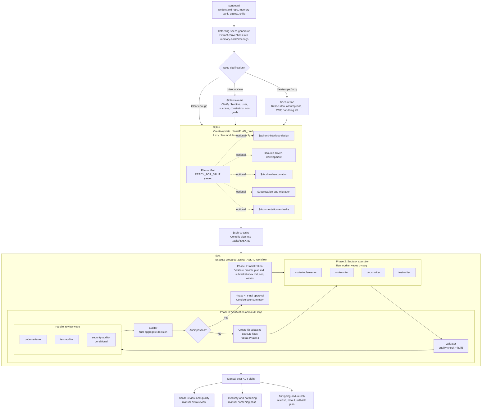

# Codex Scaffold

This repository is a reusable setup scaffold for running Codex through a structured Plan-and-Act workflow.

It is not an application codebase. It is a collection of skills, subagent definitions, memory-bank templates, and task artifact conventions that help Codex turn an idea into a planned task, execute it with specialized agents, validate the result, and audit the work before final approval.

## What Is This Project?

The scaffold organizes agentic work into a repeatable pipeline:

1. Capture project knowledge and conventions in `.memory-bank/`.
2. Shape an idea into a durable `.plans/PLAN_*.md` planning artifact.
3. Compile the approved plan into ACT-ready `.tasks/{TASK-ID}/` artifacts.
4. Execute subtasks with worker agents.
5. Validate, review, audit, and create fix subtasks when needed.
6. Present a final approval summary, then optionally prepare release activities.

The main pipeline is:

```text
$onboard
$steering-specs-generator
$interview-me / $idea-refine
$plan
$split-to-tasks
$act
optional post-ACT skills
```

## Core Concepts

| Concept | Definition |
| --- | --- |
| Skill | A reusable workflow instruction set in `.agents/skills/*/SKILL.md`. Skills can be invoked directly, or loaded lazily by another skill when their trigger applies. |
| Agent | A specialized runtime subagent configured in `.codex/agents/*.toml`. ACT uses agents for implementation, validation, review, and final audit. |
| Hook | A project-local Codex event integration configured in `.codex/hooks.json`. Hooks can inspect tool calls or user prompts before Codex continues. |
| Steering | Durable project convention stored in `.memory-bank/steerings/`. Workers read these before implementing or testing. |
| Plan | A source-of-truth planning artifact at `.plans/PLAN_*.md`. `$split-to-tasks` requires `READY_FOR_SPLIT: yes`. |
| Task | An ACT execution folder at `.tasks/{TASK-ID}/` containing `plan.md`, `subtasks/index.md`, and `stt-*.md` files. |
| Subtask | A focused unit of work assigned to exactly one Phase 2 worker agent and scheduled with `seq=N`. |
| Review report | A Phase 3 artifact written under `.tasks/{TASK-ID}/reviews/`. |
| Audit report | The final Phase 3 decision artifact written under `.tasks/{TASK-ID}/audits/`. |

## Pipeline Overview

The scaffold has three main responsibilities:

- Planning: clarify intent, choose scope, capture constraints, and mark a plan ready only when it can be split without inventing requirements.
- Execution: run the exact subtasks declared in `.tasks/{TASK-ID}/subtasks/index.md`, in numeric `seq` waves.
- Verification: validate quality/build output, run specialized reviewers, aggregate findings in a final audit, and loop through fix subtasks until the task passes or needs human escalation.

ACT is deliberately an executor, not a planner. It does not reorder subtasks, invent missing work, or patch code directly from audit findings. Blocking findings become new fix subtasks, then the normal worker path runs again.

## Skills By Phase

| Phase | Skill | File | Purpose |
| --- | --- | --- | --- |
| Setup and context | `$onboard` | [`.agents/skills/onboard/SKILL.md`](.agents/skills/onboard/SKILL.md) | Read repo context, recent state, memory-bank notes, and Serena memories. |
| Setup and context | `$steering-specs-generator` | [`.agents/skills/steering-specs-generator/SKILL.md`](.agents/skills/steering-specs-generator/SKILL.md) | Extract tacit conventions into steering files and action items. |
| Pre-plan clarification | `$interview-me` | [`.agents/skills/interview-me/SKILL.md`](.agents/skills/interview-me/SKILL.md) | Clarify objective, audience, success criteria, constraints, and non-goals. |
| Pre-plan clarification | `$idea-refine` | [`.agents/skills/idea-refine/SKILL.md`](.agents/skills/idea-refine/SKILL.md) | Refine fuzzy ideas into assumptions, MVP scope, and not-doing decisions. |
| Planning | `$plan` | [`.agents/skills/plan/SKILL.md`](.agents/skills/plan/SKILL.md) | Create or update `.plans/PLAN_*.md` as the source of truth. |
| Lazy plan module | `$api-and-interface-design` | [`.agents/skills/api-and-interface-design/SKILL.md`](.agents/skills/api-and-interface-design/SKILL.md) | Guide APIs, schemas, CLI contracts, component props, and module boundaries. |
| Lazy plan module | `$source-driven-development` | [`.agents/skills/source-driven-development/SKILL.md`](.agents/skills/source-driven-development/SKILL.md) | Ground version-sensitive framework or library decisions in official docs. |
| Lazy plan module | `$ci-cd-and-automation` | [`.agents/skills/ci-cd-and-automation/SKILL.md`](.agents/skills/ci-cd-and-automation/SKILL.md) | Plan command contracts, quality gates, CI, build, and deployment automation. |
| Lazy plan module | `$deprecation-and-migration` | [`.agents/skills/deprecation-and-migration/SKILL.md`](.agents/skills/deprecation-and-migration/SKILL.md) | Plan safe replacement, migration, removal, compatibility, and rollback. |
| Lazy plan module | `$documentation-and-adrs` | [`.agents/skills/documentation-and-adrs/SKILL.md`](.agents/skills/documentation-and-adrs/SKILL.md) | Decide docs, ADRs, changelog, README, and memory-bank requirements. |
| Task compilation | `$split-to-tasks` | [`.agents/skills/split-to-tasks/SKILL.md`](.agents/skills/split-to-tasks/SKILL.md) | Convert a ready plan into `.tasks/{TASK-ID}/` ACT artifacts. |
| Execution | `$act` | [`.agents/skills/act/SKILL.md`](.agents/skills/act/SKILL.md) | Execute prepared subtasks, validate, review, audit, and manage fix loops. |
| Optional post-ACT | `$code-review-and-quality` | [`.agents/skills/code-review-and-quality/SKILL.md`](.agents/skills/code-review-and-quality/SKILL.md) | Run an extra manual multi-axis review when desired. |
| Optional post-ACT | `$security-and-hardening` | [`.agents/skills/security-and-hardening/SKILL.md`](.agents/skills/security-and-hardening/SKILL.md) | Run an extra manual security design or hardening pass. |
| Optional post-ACT | `$shipping-and-launch` | [`.agents/skills/shipping-and-launch/SKILL.md`](.agents/skills/shipping-and-launch/SKILL.md) | Prepare release, rollout, monitoring, and rollback plans. |
| Prompt work | `$prompt-engineering` | [`.agents/skills/prompt-engineering/SKILL.md`](.agents/skills/prompt-engineering/SKILL.md) | Guide and route prompt writing, improvement, debugging, and optimization. |
| Prompt work | `$prompt-clarity-and-structure` | [`.agents/skills/prompt-clarity-and-structure/SKILL.md`](.agents/skills/prompt-clarity-and-structure/SKILL.md) | Improve prompt clarity, structure, examples, delimiters, and output consistency. |
| Prompt work | `$prompt-reasoning-and-chaining` | [`.agents/skills/prompt-reasoning-and-chaining/SKILL.md`](.agents/skills/prompt-reasoning-and-chaining/SKILL.md) | Design multi-step reasoning and chained LLM workflows with validation. |
| Prompt work | `$prompt-grounding-and-rag` | [`.agents/skills/prompt-grounding-and-rag/SKILL.md`](.agents/skills/prompt-grounding-and-rag/SKILL.md) | Reduce hallucinations and improve grounding, long-context handling, chunking, and reranking. |
| Prompt work | `$prompt-agents-and-tools` | [`.agents/skills/prompt-agents-and-tools/SKILL.md`](.agents/skills/prompt-agents-and-tools/SKILL.md) | Design tool schemas, agent loops, state, termination, error handling, and handoffs. |
| Prompt work | `$prompt-security-and-production` | [`.agents/skills/prompt-security-and-production/SKILL.md`](.agents/skills/prompt-security-and-production/SKILL.md) | Harden prompts against injection and improve portability, caching, and multimodal behavior. |
| Prompt work | `$prompt-evaluation` | [`.agents/skills/prompt-evaluation/SKILL.md`](.agents/skills/prompt-evaluation/SKILL.md) | Build eval sets, metrics, comparisons, regression tests, and production monitoring. |

## Agents By ACT Phase

| ACT phase | Agent | File | Purpose |
| --- | --- | --- | --- |
| Phase 2 worker | `code-implementer` | [`.codex/agents/code-implementer.toml`](.codex/agents/code-implementer.toml) | Implement normal feature, refactor, and fix subtasks. |
| Phase 2 worker | `code-writer` | [`.codex/agents/code-writer.toml`](.codex/agents/code-writer.toml) | Handle narrow direct code-writing subtasks. |
| Phase 2 worker | `docs-writer` | [`.codex/agents/docs-writer.toml`](.codex/agents/docs-writer.toml) | Create or update technical documentation artifacts. |
| Phase 2 worker | `test-writer` | [`.codex/agents/test-writer.toml`](.codex/agents/test-writer.toml) | Write focused tests for assigned behavior. |
| Phase 3 gate | `validator` | [`.codex/agents/validator.toml`](.codex/agents/validator.toml) | Run quality check and build commands from `project-commands.md`. |
| Phase 3 gate | `code-reviewer` | [`.codex/agents/code-reviewer.toml`](.codex/agents/code-reviewer.toml) | Produce a read-only engineering review report. |
| Phase 3 gate | `test-auditor` | [`.codex/agents/test-auditor.toml`](.codex/agents/test-auditor.toml) | Evaluate whether tests adequately cover the plan. |
| Phase 3 gate | `security-auditor` | [`.codex/agents/security-auditor.toml`](.codex/agents/security-auditor.toml) | Conditionally audit security-sensitive changes. |
| Phase 3 final gate | `auditor` | [`.codex/agents/auditor.toml`](.codex/agents/auditor.toml) | Aggregate validator and reviewer outputs into the authoritative audit decision. |

## Hooks

| System | Event | Config | Source | Purpose |
| --- | --- | --- | --- | --- |
| `bash-guard` | `PreToolUse` for `Bash` | [`.codex/hooks.json`](.codex/hooks.json) | [`.codex/hooks/bash-guard/src/`](.codex/hooks/bash-guard/src/) | Checks Bash commands before execution and blocks risky commands until explicitly approved. |
| `bash-guard` | `UserPromptSubmit` | [`.codex/hooks.json`](.codex/hooks.json) | [`.codex/hooks/bash-guard/src/user_prompt.go`](.codex/hooks/bash-guard/src/user_prompt.go) | Records one-shot approvals for prompts shaped as `approve-risk <hash>`. |

Both hook entries use the same Go binary:

```text
.codex/hooks/bash-guard/src/bash_guard.bin
```

Build it locally before relying on the hook:

```bash
bash .codex/hooks/bash-guard/build.sh
```

Then open `/hooks` in Codex and review/trust the project hooks. See [`.codex/hooks/hooks_readme.md`](.codex/hooks/hooks_readme.md) for the hook-specific setup notes.

## How To Use The Pipeline

### 1. Onboard to the repo

Use `$onboard` when starting in a repository, after context loss, or before significant work. It reads the memory bank, recent repo state, and Serena memories when available.

### 2. Define project conventions

If `.memory-bank/steerings/` still contains templates or missing project rules, use `$steering-specs-generator`.

At minimum, ACT workers expect:

```text
.memory-bank/steerings/development-conventions.md
.memory-bank/steerings/testing-conventions.md
.memory-bank/steerings/project-commands.md
```

Before real ACT execution, replace template command placeholders in `project-commands.md` with concrete quality, build, and test commands.

### 3. Build and trust local hooks

Build the Bash safety hook:

```bash
bash .codex/hooks/bash-guard/build.sh
```

Then open `/hooks` in Codex and trust the project-local hooks. The hook protects Bash tool usage and supports one-shot approval prompts for risky commands.

### 4. Clarify only when needed

Use optional pre-plan skills when the request is not ready to plan:

- `$interview-me` when intent, user, success criteria, constraints, or non-goals are unclear.
- `$idea-refine` when the idea, direction, or MVP scope is still fuzzy.

Skip both when the request is already concrete enough for `$plan`.

### 5. Create the plan

Use `$plan` to create or update:

```text
.plans/PLAN_{id-or-feature-name}.md
```

The plan may load lazy modules only when their trigger applies. Set:

```text
READY_FOR_SPLIT: yes
```

only when all blocking decisions are made.

### 6. Split the plan into ACT artifacts

Run `$split-to-tasks` only after the plan is ready:

```text
$split-to-tasks .plans/PLAN_feature-name.md TASK-001
```

It creates:

```text
.tasks/{TASK-ID}/
├── plan.md
└── subtasks/
    ├── index.md
    ├── stt-001.md
    ├── stt-002.md
    └── ...
```

### 7. Execute with ACT

Switch to a task-specific branch, then run:

```text
$act TASK-001
```

ACT will validate the task folder, execute subtask waves by `seq`, run validation and review gates, create fix subtasks for blocking findings, and stop for final user approval after all required gates pass.

### 8. Use post-ACT skills manually

After ACT passes, use these only when useful:

- `$code-review-and-quality` for an extra manual review.
- `$security-and-hardening` for an extra security hardening pass.
- `$shipping-and-launch` for release, rollout, monitoring, and rollback planning.

## Required Files And Artifacts

Before `$act`, the repo should contain:

```text
.memory-bank/steerings/development-conventions.md
.memory-bank/steerings/testing-conventions.md
.memory-bank/steerings/project-commands.md
.plans/PLAN_{id-or-feature-name}.md
.tasks/{TASK-ID}/plan.md
.tasks/{TASK-ID}/subtasks/index.md
```

Each `subtasks/index.md` entry must use this shape:

```markdown
- [ ] stt-001 | code-implementer | feature | seq=1 / Build feature shell
      Scaffold the core structure for the feature.
```

Rules:

- `seq=N` is the only scheduling mechanism.
- Same `seq` means subtasks may run in parallel.
- Higher `seq` waits for lower `seq`.
- Agent names must be exact runtime IDs.
- Phase 3 agents must never appear in `subtasks/index.md`.

All Phase 2 workers receive the same contract:

```text
task_id
task_root
plan_path
subtask_path
```

## Pipeline Diagram



## Common Mistakes

- Running `$act` while steering files are still generic templates.
- Leaving concrete quality, build, or test commands undefined in `project-commands.md`.
- Trusting hooks before building `.codex/hooks/bash-guard/src/bash_guard.bin`.
- Running `$split-to-tasks` before the plan says `READY_FOR_SPLIT: yes`.
- Using display names instead of exact skill or agent IDs.
- Forgetting `seq=N` in `subtasks/index.md`.
- Placing `validator`, `code-reviewer`, `test-auditor`, `security-auditor`, or `auditor` in Phase 2 subtasks.
- Treating `$act` as a planner instead of an executor.
- Editing task order in prose instead of encoding it with `seq`.

## Acknowledgements

This scaffold stands on useful prior art and generous shared work:

- [Timur Khahalev](https://github.com/timurkhakhalev) - for the general Plan-and-Act idea and core skill patterns.
- [agent-skills](https://github.com/addyosmani/agent-skills) - curated by Google repo used as a reference point on subagents and skills for Claude.
- [Rodion Mostovoi / CodeAlive-AI](https://github.com/CodeAlive-AI/ai-driven-development/tree/main/hooks/balanced-safety-hooks) - for the original Claude-oriented Bash safety hooks.
- [Kamen Zhekov](https://github.com/kzhekov/Prompt-Engineering-Skill) - for the prompt engineering skills.

## Dive Deeper

Read these files in order:

1. [`.agents/skills/act/SKILL.md`](.agents/skills/act/SKILL.md)
2. [`.agents/skills/plan/SKILL.md`](.agents/skills/plan/SKILL.md)
3. [`.agents/skills/split-to-tasks/SKILL.md`](.agents/skills/split-to-tasks/SKILL.md)
4. [`.agents/skills/steering-specs-generator/SKILL.md`](.agents/skills/steering-specs-generator/SKILL.md)
5. [`.codex/agents/`](.codex/agents/)

For a real downstream project, the fastest way to validate the scaffold is to customize the steerings, create one small plan, split it into a task, and run `$act` on a task-specific branch.
